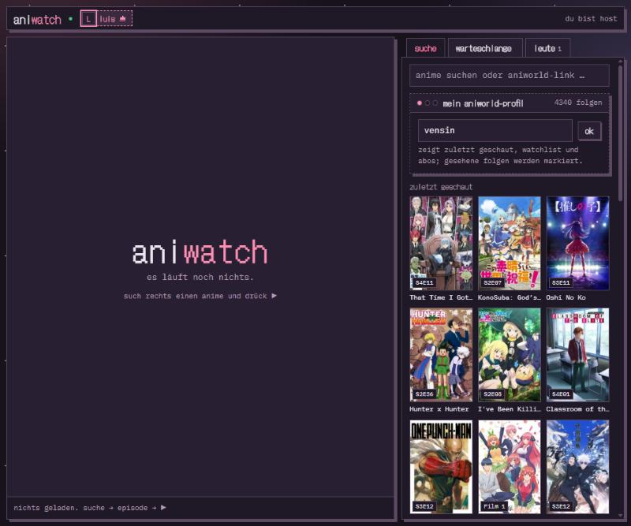

# aniwatch

<!-- cozy:cards -->
<div align="center">

<a href="https://github.com/vxnsin/aniwatch"><picture><source media="(prefers-color-scheme: dark)" srcset="https://raw.githubusercontent.com/vxnsin/aniwatch/output/repo-dark.svg?v=0a96cf5f75"></picture></a>

<a href="https://github.com/vxnsin/aniwatch#einrichten"><picture><source media="(prefers-color-scheme: dark)" srcset="https://raw.githubusercontent.com/vxnsin/aniwatch/output/nav-setup-dark.svg?v=ecdb5ba37c"></picture></a><a href="https://github.com/vxnsin/aniplay"><picture><source media="(prefers-color-scheme: dark)" srcset="https://raw.githubusercontent.com/vxnsin/aniwatch/output/nav-aniplay-dark.svg?v=5ea8f2880f"></picture></a>

<a href="https://github.com/vxnsin/aniwatch/commits"><picture><source media="(prefers-color-scheme: dark)" srcset="https://raw.githubusercontent.com/vxnsin/aniwatch/output/commits-dark.svg?v=dcfe748b65"></picture></a>

<a href="https://github.com/vxnsin/aniwatch/graphs/contributors"><picture><source media="(prefers-color-scheme: dark)" srcset="https://raw.githubusercontent.com/vxnsin/aniwatch/output/contributors-dark.svg?v=7714bebd26"></picture></a>

</div>
<!-- /cozy:cards -->

Anime zusammen schauen, direkt im Discord-Sprachkanal. aniwatch ist eine **Discord Activity**: Einer startet sie und ist Host, alle anderen schauen synchron mit, reihen Folgen ein und quatschen nebenbei. Die Folgen kommen von aniworld.to.

<p align="center"></p>

## Was es kann

- **Host-Rolle:** Wer die Activity zuerst öffnet, ist Host und steuert: Folge starten, Pause, spulen, Sprache, Hoster, nächste Folge. Der Host kann die Rolle abgeben oder „alle dürfen steuern“ einschalten. Lädt der Host kurz neu, bleibt die Rolle 25 Sekunden für ihn reserviert.
- **Alle synchron:** Der Server führt die Uhr, jeder Client gleicht kleine Abweichungen über die Abspielgeschwindigkeit aus und springt bei großen. Wer später dazukommt, landet direkt an der richtigen Stelle.
- **Warteschlange:** Jeder darf Folgen oder ganze Staffeln einreihen und eigene Einträge entfernen. Ist die Schlange leer, läuft mit Autoplay die nächste Folge weiter, auch über Staffelgrenzen.
- **Suche mit Autocomplete** beim Tippen, oder einfach einen aniworld-Link einfügen.
- **AniWorld-Profil pro Person**, optional: zuletzt geschaut, Watchlist und Abos als Schnellauswahl, gesehene Folgen bekommen einen Haken.
- **Vollbild** mit einer Leiste, die ein- und ausfährt. Erlaubt Discord kein echtes Vollbild, füllt der Player das ganze Activity-Fenster.
- **Ladeanzeige**, automatischer **Hoster-Wechsel**, wenn ein Stream nicht spielt, und stummer Autostart mit „ton an“-Knopf, wenn der Browser ohne Klick keinen Ton erlaubt.
- Discord-Profile aller Anwesenden oben in der Leiste, der Host mit Krone. Rich Presence „schaut Solo Leveling · S1E01“.
- Chat im Raum. Raum, Warteschlange und Fortschritt überleben einen Server-Neustart (SQLite).

## Bedienung

| wer | darf |
|---|---|
| Host | Folge starten, Play/Pause, spulen, Sprache und Hoster, nächste Folge, Stop, Warteschlange sortieren und leeren, Host abgeben, „alle dürfen steuern“ |
| alle | suchen, einreihen, eigene Einträge entfernen, Lautstärke, Vollbild, neu synchronisieren, Chat, eigenes AniWorld-Profil |

Tastatur: `Space` Play/Pause, `←` `→` ±10 Sekunden, `f` Vollbild, `m` stumm, `Esc` Vollbild beenden.

## Einrichten

Du brauchst eine Discord-App, einen Rechner, der dauerhaft läuft (ein Raspberry Pi reicht), und eine Domain, die per HTTPS auf diesen Rechner zeigt. Discord lädt Activities nur über eine feste HTTPS-Adresse.

### 1. Discord-App anlegen

1. Auf https://discord.com/developers/applications eine neue App anlegen. Als Icon passt [`.github/logo.png`](.github/logo.png).
2. **OAuth2:** Client ID und Client Secret notieren. Unter „Redirects“ den Platzhalter `https://127.0.0.1` eintragen. Activities leiten nie um, Discord verlangt beim Login aber einen registrierten Wert.
3. **Activities → URL-Zuordnungen:** Präfix `/`, Ziel deine Domain ohne `https://`, zum Beispiel `aniwatch.example.org`. Weitere Zuordnungen braucht es nicht, Streams, Bilder und Fonts laufen alle über den eigenen Server.
4. **Activities → Einstellungen:** Activities aktivieren, Web, iOS und Android anhaken.
5. **General Information:** Terms of Service `https://<deine-domain>/terms`, Privacy Policy `https://<deine-domain>/privacy`. Beide Seiten liefert der Server mit.
6. Solange die App nicht veröffentlicht ist, sehen sie nur Leute, die unter „App Testers“ eingetragen sind.

Für die Activity-Assets liegen [`.github/cover.png`](.github/cover.png) und [`.github/background.png`](.github/background.png) bereit, beide 1024 × 576.

### 2. Server einrichten

Auf einem Raspberry Pi oder einem anderen Debian-Rechner:

```bash
curl -fsSL https://raw.githubusercontent.com/vxnsin/aniwatch/main/scripts/setup-pi.sh | bash
```

Das Script fragt nach Repo, Domain, Ordner, Port, Dienstname und ob der DNS-Eintrag bei Vercel automatisch auf deine Heim-IP gesetzt werden soll. Enter übernimmt jeweils den Vorschlag. Danach erledigt es:

- Node 22.13 oder neuer und [Caddy](https://caddyserver.com) installieren, falls sie fehlen
- die App klonen und bauen, die Daten nach `/var/lib/aniwatch` legen
- einen systemd-Dienst `aniwatch` anlegen, der beim Booten startet
- einen eigenen Caddy-Block mit automatischem HTTPS-Zertifikat anlegen, ohne andere Seiten auf demselben Rechner anzufassen
- optional einen Cron-Job, der den A-Record bei Vercel aktuell hält

Beim ersten Lauf fragt es nach der Discord Client ID und dem Secret und schreibt beides nach `/etc/aniwatch.env`. Updates später: das Script einfach erneut starten, es zieht die neue Version, baut und startet neu. Ohne Fragen geht es auch:

```bash
DOMAIN=aniwatch.example.org bash ~/aniwatch/scripts/setup-pi.sh --yes
```

Im Router müssen die Ports 80 und 443 auf den Rechner zeigen. Test von außen: `https://<deine-domain>/api/info` liefert JSON.

### 3. Starten

In Discord einen Sprachkanal betreten, unten auf das Raketen-Symbol „Aktivitäten“, dort steht aniwatch. Wer sie startet, ist Host.

## Lokal entwickeln

```bash
npm install
cp .env.example .env
npm run build
npm start
```

In der `.env` steht `ALLOW_DEV=1`, dann geht es ohne Discord im Browser: `http://localhost:3100/?dev=1&name=luis&room=test`, in einem zweiten Tab mit `name=mia`. Für Änderungen am Client `npm run dev:client` (Vite mit Proxy auf den Server). In der Browser-Konsole liegt `aniwatch.state` zum Nachschauen.

Fehler aus dem Client, etwa blockierte Bilder, Player- oder HLS-Fehler, landen im Server-Log:

```bash
journalctl -u aniwatch -f
```

## Aufbau

```
server/index.js    Express, Discord-Login, WebSocket pro Raum, Stream- und Bild-Proxy
server/rooms.js    Raum: Host, Warteschlange, Sync, Autoplay, Hoster-Fallback
server/db.js       SQLite (node:sqlite): Nutzer, Sessions, Raumzustand, Fortschritt
lib/               aniworld-Scraper und ein Loader pro Hoster
client/            Vite-App: discord.js (SDK), main.js (UI und Player), style.css
client/public/     Fonts, Icon, Nutzungsbedingungen, Datenschutz
scripts/setup-pi.sh  Einrichtung auf einem Pi oder Server
```

Streams laufen über `/api/proxy`, damit Referer und User-Agent der Hoster stimmen. Innerhalb von Discord ist nur die eigene Adresse erreichbar, deshalb sind Fonts lokal und Cover über `/api/img` durchgereicht.

## Hoster

| hoster | modus |
|---|---|
| VOE | HLS, MP4 als Ersatz |
| Vidmoly | HLS |
| Filemoon | HLS, auf manchen Domains nur als Iframe |
| Vidoza, Streamtape | MP4 |
| Doodstream | nur Iframe, dann ohne Synchronisation |

Neuer Hoster: eine Datei in `lib/loaders/` mit `name`, `matches(url)` und `resolve(url)`, sie wird automatisch geladen.

## Hinweise

- Wer aniwatch selbst betreibt, passt `client/public/terms.html` und `client/public/privacy.html` an sich als Betreiber an.
- Die Inhalte kommen von aniworld.to und den jeweiligen Hostern, aniwatch speichert keine Videos. Ob das Ansehen bei dir erlaubt ist, liegt in deiner Verantwortung.
- Schwesterprojekt für das Wohnzimmer, TV als Player und Handy als Fernbedienung: [aniplay](https://github.com/vxnsin/aniplay).

## Lizenz

MIT
